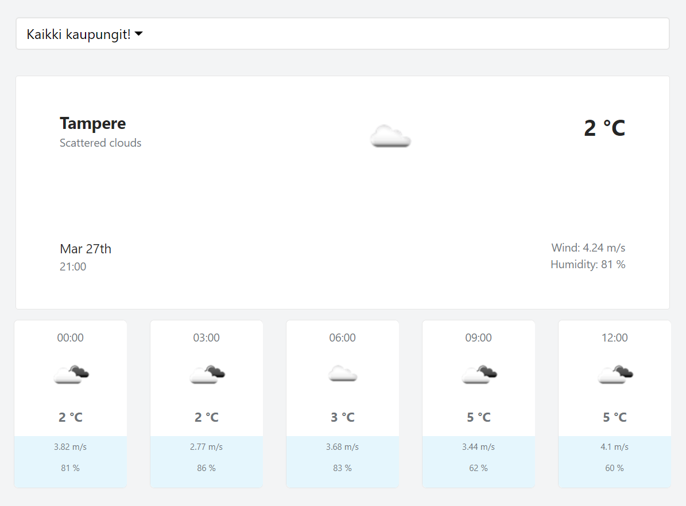

This project was bootstrapped with [Create React App](https://github.com/facebook/create-react-app).

## DEMO

### `npm start`

- Runs the app in the development mode.
- Open [http://localhost:3000](http://localhost:3000) to view it in the browser.

- The page will reload if you make edits.
- You will also see any lint errors in the console.

### Run
- Clone the repository
- Run npm install from inside the repository
- Run npm start. Your default browser will automatically opens with the app. You can also access it from http://localhost:3000/

### Process of creation
- This project was bootstrapped with Create React App
- I used create-react-app to generate the app, then I ejected it in order to add a few additional features to the build process.
- I've added sass-loader to webpack to use SASS instead of regular CSS.
- The app follows a modular architecture to organize the different components.
- I use the ES6 (...and more) syntax as much as possible.
- I don't use Redux because it's not needed for such a small app.

